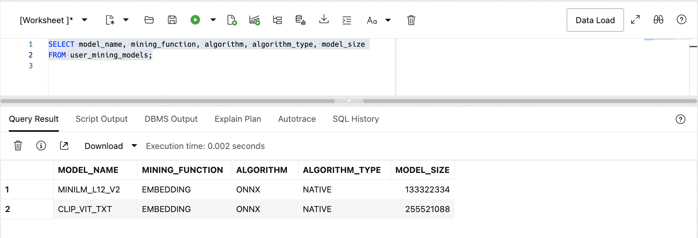
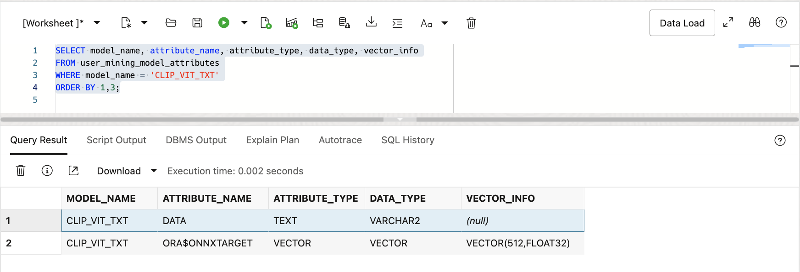

# Similarity Search on Images

## Introduction

This lab walks you through the steps to run similarity searches on images using text or images as search criteria.

Watch the video below for a quick walk-through of the similarity search on images lab:

[Similarity Search on Images](https://videohub.oracle.com/media/Vector-Search-Image-Search-Lab/1_6hwxhdjg)

Estimated Lab Time: 10 minutes

### About Image Similarity Search

In the previous labs, we looked at embedding models and similarity search on text-based data. Now we are going to look at something even more impressive. The ability to use text phrases or images to search for images. This will require using different embedding models depending on whether a text phrase or an image is being used for the search comparison. In this lab we will be using the multi-modal embedding model CLIP (Contrastive Language-Image Pretraining) which is a deep learning model developed by OpenAI.  that understands how to vectorize an image for input to our similarity search. This lab will continue We will again be using the US National Parks dataset. Recall that there are two tables in this dataset, one that describes parks and then another that has images for those parks. We are going to search for images using text phrases or images, and then also combine a query to join the two tables and look through images based on a general location.

The vector embeddings for the dataset images have already been created since that would have taken too long for this lab environment, but we will still take a look at them. The embedding model that was used to create the vector embeddings was also the CLIP multi-modal embedding pipeline, and can be split into two different ONNX compatible embedding models to allow searching for images based on text phrases or actual images as mentioned previously. This is described in more detail in the [Oracle AI Vector Search User's Guide] (https://docs.oracle.com/en/database/oracle/oracle-database/23/vecse/onnx-pipeline-models-multi-modal-embedding.html). Both of these models have already been loaded into the database as you saw earlier. The text version is called CLIP\_VIT\_TXT and the image version is called CLIP\_VIT\_IMG.


### Objectives

In this lab, you will:

* Look at the image embedding model characteristics
* Describe the vector column in the images table PARK_IMAGES
* Run exhaustive similarity searches for specific images
* Run combined similarity and relational searches

### Prerequisites

This lab assumes you have:
* An Oracle Account (oracle.com account)
* All previous labs successfully completed


## Task 1: Display the CLIP embedding models

The CLIP embedding models have already been converted to ONNX format and loaded into the database. This was described in the lab introduction and is the same model that was used to create the vectors of the park images, which were also pre-loaded.

1. Display the CLIP embedding models:

    ```
    <copy>
    SELECT model_name, mining_function, algorithm, algorithm_type, model_size
    FROM user_mining_models;
    </copy>
    ```

    

      
2. Display the model details:

    ```
    <copy>
    SELECT model_name, attribute_name, attribute_type, data_type, vector_info
    FROM user_mining_model_attributes
    WHERE model_name LIKE 'CLIP%'
    ORDER BY 1,3;
    </copy>
    ```

    

    You may notice that the VECTOR\_INFO column displays 'VECTOR(512,FLOAT32)' for this model which is different than what we saw for the all\_MiniLM\_L12\_v2 model which was VECTOR(384, FLOAT32).  This means that the CLIP model uses 512 dimensions.


## Task 2: Display the Vector column in the PARKS_IMAGES table

In this task we will take a look at the PARK\_IMAGES table. The table itself has a URL to the park images, they are not actually stored in the table. Vector embeddings of each of those images have been created and stored in the IMAGES\_VECTOR column. These embeddings were created externally using the CLIP embedding model.

1. Display the columns in the PARK\_IMAGES table by clicking on the arrow next to the PARK\_IMAGES table in the SQL Developer Web navigator column on the left. Alternatively you can right-click on the PARK\_IMAGES table and click the "Open" option.

    See the image below:

    

2. Display one of the vectors in IMAGE\_VECTOR column:

    ```
    <copy>
    SELECT image_vector
    FROM park_images
    FETCH FIRST 1 ROWS ONLY;
    </copy>
    ```

    

    You can select the IMAGE\_VECTOR and then click on the eye image to expand the entire vector:

    

## Task 3: Run image based similarity searches

In this task we will run similar queries to the ones we ran in the previous labs, but now we will use our text phrases to search the image vectors in the PARKS\_IMAGES table, not text vectors that were in the PARKS table.

1. First we can search for Civil War park images:

    ```
    <copy>
    SELECT description, url
    FROM park_images
    ORDER BY VECTOR_DISTANCE(image_vector,
      VECTOR_EMBEDDING(clip_vit_txt USING 'Civil War' AS data), COSINE)
    FETCH EXACT FIRST 10 ROWS ONLY;
    </copy>
    ```

    

    If you click on the first URL and then click on the eye icon the URL will open in a new window:

    
    
    If you then highlight the URL and right click on it a dialog box will open. Depending on your browser, there should be an option to open the URL in a new window. The following example uses Google Chrome, other browsers use slightly different terminology. With Google Chrome you can choose the "Go to ..." option to open the image in a new browser window:
    
    
    
    You should see an image like the following:

    

2. Now let's see if we can find images that have rock climbing, but this time we will search with an image of a rock climber and not the phrase "rock climbing". For simplicity we will use one of the images from the PARK\_IMAGES table to use as our search criteria. This will involve a bit of PL/SQL to do, but in the interest of showing you how it is done we chose not to embed the details in a separate function.

    In the APEX_DEMO lab we will let you choose your own image to search on, but the following shows you how to accomplish this with SQL:

    ```
    <copy>
    DECLARE
      v_image_url     VARCHAR2(1000);
      l_http_request  UTL_HTTP.req;
      l_http_response UTL_HTTP.resp;
      l_blob          BLOB;
      l_raw           RAW(32767);
      l_buffer_size   PLS_INTEGER := 32767;
    BEGIN
      --
      -- Get the URL of an image for the closest match to "Rock Climbing"
      --
      SELECT url
      INTO v_image_url
      FROM park_images
      ORDER BY VECTOR_DISTANCE(image_vector,
        VECTOR_EMBEDDING(clip_vit_txt USING 'Rock Climbing' AS data), COSINE)
      FETCH EXACT FIRST 1 ROWS ONLY;
      --
      -- The following uses the previously found URL and loads the 
      -- corresponding image into a BLOB
      --
      DBMS_LOB.createtemporary(l_blob, FALSE);
      l_http_request := UTL_HTTP.begin_request(v_image_url, 'GET');
      --
      l_http_response := UTL_HTTP.get_response(l_http_request);
      --
      BEGIN
        LOOP
          UTL_HTTP.read_raw(l_http_response, l_raw, l_buffer_size);
          DBMS_LOB.append(l_blob, l_raw);
        END LOOP;
      EXCEPTION
        WHEN UTL_HTTP.end_of_body THEN
          UTL_HTTP.end_response(l_http_response);
      END;
      --
      -- The following uses the image from above to search for the top 10
      -- closest matches to that image. Notice that an image vector is
      -- created using the CLIP_VIT_IMG embedding model.
      --
      FOR image_rec IN (
        SELECT description, url
        FROM park_images
        ORDER BY VECTOR_DISTANCE(image_vector,
          VECTOR_EMBEDDING(clip_vit_img USING l_blob AS data), COSINE)
        FETCH EXACT FIRST 10 ROWS ONLY
      ) LOOP
        --
        DBMS_OUTPUT.PUT_LINE('Description: ' || image_rec.description);
        DBMS_OUTPUT.PUT_LINE('URL: ' || image_rec.url);
      END LOOP;
      --
      DBMS_LOB.freetemporary(l_blob);
    END;
    </copy>
    ```

    

    If you highlight a resulting URL and right click you can choose the "Go to ..." option to open the image in a new browser tab:

    

3. Lastly, let's search for waterfalls, but let's add a twist. We will add a join to the PARKS table so we can include the park location details. Since the author of this Lab is based out of Redwood Shores, CA we will restrict our query of parks with waterfalls to the western United States:

    ```
    <copy>
    SELECT p.description, p.city, p.states, pi.url
    FROM park_images pi, parks p
    WHERE pi.park_code = p.park_code
      AND p.states in ('CA','OR','NV','WA','AZ','CO')
    ORDER BY VECTOR_DISTANCE(pi.image_vector,
      VECTOR_EMBEDDING(clip_vit_txt USING 'waterfall' AS data), COSINE)
    FETCH EXACT FIRST 10 ROWS ONLY;
    </copy>
    ```

    

    If you click on the first URL, click on the eye icon, then highlight the URL and right click you can choose the "Go to ..." option to open the image in a new browser tab:

    


You may now **proceed to the next lab**


## Learn More

* [Oracle AI Vector Search Users Guide](https://docs.oracle.com/en/database/oracle/oracle-database/26/vecse/index.html)
* [OML4Py: Leveraging ONNX and Hugging Face for AI Vector Search](https://blogs.oracle.com/machinelearning/post/oml4py-leveraging-onnx-and-hugging-face-for-advanced-ai-vector-search)
* [Oracle Database 26ai Release Notes](https://docs.oracle.com/en/database/oracle/oracle-database/26/rnrdm/index.html)
* [Oracle Documentation](http://docs.oracle.com)

## Acknowledgements
* **Author** - Andy Rivenes, Product Manager, AI Vector Search
* **Contributors** - Sean Stacey, Product Manager, AI Vector Search
* **Last Updated By/Date** - Andy Rivenes, Product Manager, AI Vector Search, January 2026
