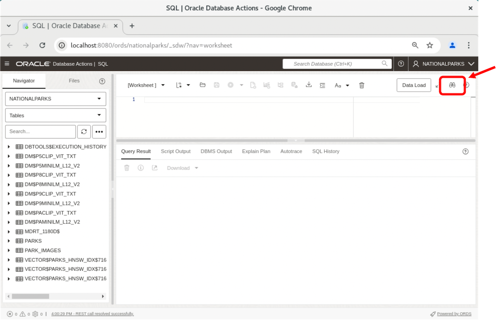

# Introduction

## About This Workshop

The **Hybrid Search** workshop will show you how you can combine text-based search with similarity search on unstructured data like text and images. We will then demonstrate how you can create a Vector Index on an Iceberg table to perform similarity search on tables that live outside of Oracle AI Database.

Estimated Workshop Time: 45 minutes

Oracle AI Vector Search is a sophisticated suite of capabilities, empowering developers to seamlessly store, index, and search vector data within Oracle Database. Vector data, represented as arrays of numbers, plays a pivotal role in capturing diverse features within unstructured data, including images, text, audio and video.

Key components of this workshop include:

*Vector Data Type*: A data type designed to store vector data directly within Oracle Database, facilitating seamless integration.

*Similarity Search*: The ability to search for semantic similarity on structured or unstructured data.

*Vector Indexes*: Specialized indexing optimized for rapid and efficient retrieval of similar vectors, enhancing the database's search efficiency.

*Hybrid Search*: The ability to combine the benefits of fast similarity search using AI Vector Search with fast keyword search using an Oracle Text domain index.

*Iceberg Tables*: Apache Iceberg is an open source table format designed to simplify the management of vast data lakes and data lakehouses while improving query performance. See [Iceberg Tables](https://www.oracle.com/autonomous-database/apache-iceberg/) for more information.

Why use AI Vector Search?

At the heart of AI Vector Search is the ability to do a similarity search. A similarity search works with the semantic representations of your data rather than the value (words or pixels) and finds similar objects quickly. For example, find other images or documents that look like this one.  It uses vectors, or more precisely vector embeddings, to search for semantically similar objects based on their proximity to each other. In other words, vector embeddings are a way of representing almost any kind of data, like text, images, videos, and even music, as points in a multidimensional space where the locations of those points and proximity to other data are semantically meaningful.

A Hybrid Search builds on the AI Vector Search foundational technology by combining similarity search with more traditional Oracle Text search to narrow the focus of the similarity search or to reinforce the similarity search. This is explained in more detail in this blog post [Using Hybrid Vector Indexes in AI Vector Search](https://blogs.oracle.com/database/using-hybrid-vector-indexes).

In this workshop we will build the AI Vector Search features that will enable you to use AI Vector Search to search on text and image data. In the interest of time, and not to get too far into all of the implementation details, we have already set up the database environment including pre-staging files, pre-loading embedding models and even pre-loading vector embeddings. All of this was done so that you could just run the labs in the workshop and see how Hybrid Search works. In our [blog posts](https://blogs.oracle.com/database/category/db-vector-search) we have gone into more detail about how AI Vector Search works and there is a wealth of information and examples in the [Oracle AI Vector Search User's Guide](https://docs.oracle.com/en/database/oracle/oracle-database/26/vecse/index.html) about how to use and implement AI Vector Search.

There will be labs that will use a Wikipedia dataset to search on articles to show the value of Hybrid Search.

### Objectives

In this workshop, you will learn how to:

* Learn about vectors and the new vector data type.
* Create vector embeddings.
* Learn what similarity search is.
* Perform an exact similarity search using basic SQL query operations.
* Create a hybrid vector index.
* Perform an exhaustive and approximate similarity search on an Iceberg table.

### Prerequisites

This lab assumes you have:

* An Oracle Account (oracle.com account)

## Dataset

This workshop uses a public source:

* A public dataset from the [Wikipedia Foundation] (https://dumps.wikimedia.org) web site.

## Tools

The examples in the Lab were run using the Google Chrome browser. If you use a different browser some attributes may look slightly different. For example, cut and paste may behave differently, and opening new windows based on a URL may have slightly different instructions.

In this Lab you will use Database Actions SQL Worksheet to access the database and run queries. The URL to invoke SQL Worksheet is listed in the "View Login Info" details. If you are not familiar with SQL Worksheet you can run through a short tutorial by clicking on the binoculars in the circled image below once you start SQL Worksheet in each of the following labs.

## Learn More

* [Oracle AI Vector Search Users Guide](https://docs.oracle.com/en/database/oracle/oracle-database/26/vecse/index.html)
* [OML4Py: Leveraging ONNX and Hugging Face for AI Vector Search](https://blogs.oracle.com/machinelearning/post/oml4py-leveraging-onnx-and-hugging-face-for-advanced-ai-vector-search)
* [Oracle Database 26ai Release Notes](https://docs.oracle.com/en/database/oracle/oracle-database/23/rnrdm/index.html)
* [Oracle Documentation](http://docs.oracle.com)

## Acknowledgements
* **Author** - Andy Rivenes, Product Manager, AI Vector Search
* **Contributors** - Ulrike Schwinn, Product Manager, AI Vector Search
* **Last Updated By/Date** - Andy Rivenes, Product Manager, AI Vector Search, July 2026
